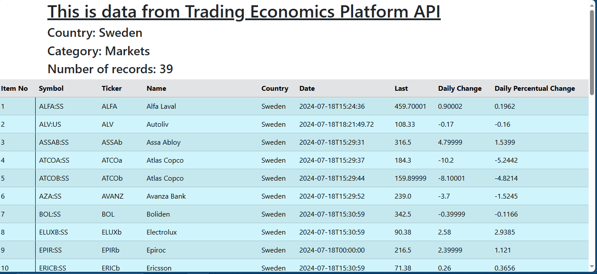

# Take Away Task at Trading Economics Platform
## Task: Create an account with TE, access their APIs and manipulate the queries to get data from an API and render the output in a web page

# My solution:
##  Stack used
- Flask
- Bootstrap
- HTML 

# Url used 
 - https://api.tradingeconomics.com/search/sweden?category=markets&c={api_key}
 
# Final Output:

## Project Structure
 - FlaskVenv - Virtual Ebnvironment
 - templates -contains HTML files
 - app.py - entry file
 - image.png - Solution Image
 - Readme.md -Description File
 - requirements.txt - Packages/Libraries used in this project

### Contact Details
 - Email: alexwaiganjo934@gmail.com 
